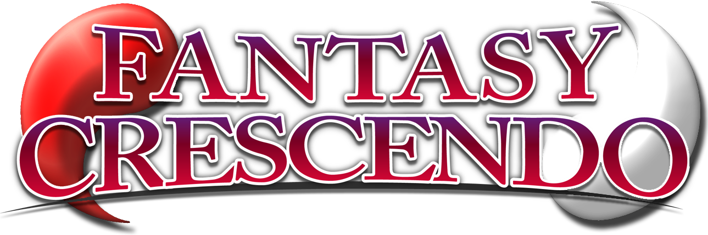

    
    

## About
*Fantasy Crescendo* is a collaborative community project to create a *[Touhou Project](https://en.touhouwiki.net/wiki/Touhou_Project)* fangame akin to that of Super Smash Bros.

This project does not only consist of code contributions, and many of the assets included are custom art, music, sound effects, and 3D designs created by community submissions. For a full list of credits, see the [credits](./CREDITS.md) file in the repository.

## Documentation
Documentation regarding the development of the game can be seen at https://wiki.houraiteahouse.net/FantasyCrescendo/Development.

## Contributing
This is an open project, intended to be a community driven project. Contributions are very welcome. Code based contributions can be received and reviewed publicly on this repository. Non-code assets like BGM or 3D models are best sent to the project's open mailbox: simply mail teahouse.hourai@gmail.com. For more information, please read [this](./CONTRIBUTING.md).

## License
First and foremost, *Fantasy Crescendo ~ Rumble Dream Ensemble* is a derivative of Touhou project. Thus, we ask that any redistirbution or derivative of this project adhere to the guidelines created by ZUN, [viewable in English here](http://en.touhouwiki.net/wiki/Touhou_Wiki:Copyrights). 

Furthermore, *Fantasy Crescendo ~ Rumble Dream Ensemble* is licensed under two seperate liscenses depending what content is in question:  
- The software (all text files) are under the Version 2 of the GPL or any later version. See [here](./LICENSE) for more information.
- The content, virtually everything else, is evaluated on a per item basis. Please contact the original creator before reproducing or editing any of the game assets.
